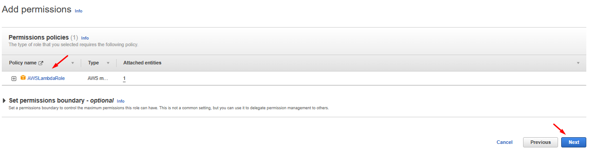
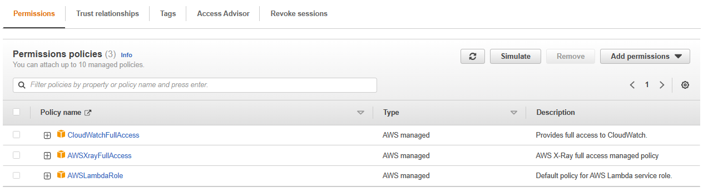

# AWS Step Functions with Lambda Detail Overview 

## Description
Walkthrough on how to use AWS Step Functions with AWS Lambda.

## Overview
`AWS Step Functions` is a visual workflow service that helps developers use AWS services to build distributed applications, automate processes, orchestrate microservices, and create data and machine learning (ML) pipelines.

`AWS Step Functions` provides serverless orchestration for modern applications. Orchestration centrally manages a workflow by breaking it into multiple steps, adding flow logic, and tracking the inputs and outputs between the steps.

As your applications execute, `Step Functions` maintains application state, tracking exactly which workflow step your application is in, and stores an event log of data that is passed between application components. That means that if networks fail or components hang, your application can pick up right where it left off.

Model your workflows as `state machines` (one per workflow).
Written in `JSON`.
`Visualization` of the workflow and the `execution` of the workflow, as well as history.
Workflows are made up of a series of `steps`, with the output of one step acting as input into the next `state`.
`States` can be `Choice state`, `Fail or Succeed`, `Pass state`, `Wait state` and `Map state`.

Visual workflow in Step Functions work as


Where, `Lambda` provides support for serverless functions that can be invoked on-demand or based on an event, and only during their invocation, compute power is used. This provides flexibility in terms of resource usages, and hence reduces costs but there is a 15 mins time limitation for a Lambda function execution, and in several use-cases, the execution may need more time.

Coming back to `Step functions`, workflows can be designed and executed that stitch together services such as AWS Lambda and Amazon ECS into feature-rich applications.

## Let’s Create a Simple Step Function
Login to AWS console and go to the Step Functions console, click on the `State machines` on left side and click on the `Create state machine` button.


Select `Write your workflow in code`, select `Standard`, write the given code and click on the `Next` button.

``` json
{
  "Comment": "A Hello World example demonstrating various state types of the Amazon States Language",
  "StartAt": "Pass",
  "States": {
    "Pass": {
      "Comment": "A Pass state passes its input to its output, without performing work. Pass states are useful when constructing and debugging state machines.",
      "Type": "Pass",
      "Next": "Hello World example?"
    },
    "Hello World example?": {
      "Comment": "A Choice state adds branching logic to a state machine. Choice rules can implement 16 different comparison operators, and can be combined using And, Or, and Not",
      "Type": "Choice",
      "Choices": [
        {
          "Variable": "$.IsHelloWorldExample",
          "BooleanEquals": true,
          "Next": "Yes"
        },
        {
          "Variable": "$.IsHelloWorldExample",
          "BooleanEquals": false,
          "Next": "No"
        }
      ],
      "Default": "Yes"
    },
    "Yes": {
      "Type": "Pass",
      "Next": "Wait 3 sec"
    },
    "No": {
      "Type": "Fail",
      "Cause": "Not Hello World"
    },
    "Wait 3 sec": {
      "Comment": "A Wait state delays the state machine from continuing for a specified time.",
      "Type": "Wait",
      "Seconds": 3,
      "Next": "Parallel State"
    },
    "Parallel State": {
      "Comment": "A Parallel state can be used to create parallel branches of execution in your state machine.",
      "Type": "Parallel",
      "Next": "Hello World",
      "Branches": [
        {
          "StartAt": "Hello",
          "States": {
            "Hello": {
              "Type": "Pass",
              "End": true
            }
          }
        },
        {
          "StartAt": "World",
          "States": {
            "World": {
              "Type": "Pass",
              "End": true
            }
          }
        }
      ]
    },
    "Hello World": {
      "Type": "Pass",
      "End": true
    }
  }
}
```


Give the `Name`, create a new `Role` if it’s not already created. Go to `IAM`, click left side on `Roles` and click on `Create role` button.


Select `AWS service`, in `Use case` search for `Step functions`, select and click on the `Next` button.


In permissions `AWSLambdaRole` already added, click on the `Next` button.




Give the Name and click on `Create role` button.


After creation, go inside the role and click on `Add permissions`, `Attach policies` to attach `CloudWatch` and `XRay` policies permissions and click on the `Attach policies` button.





Now back in AWS Step Functions console, provide `State machine name`, select the role just created, enable the logs and click on the `Create state machine` button.


To test and execute your `Step Functions`, go inside the State Machine and click on the `Start execution` button, it’s ask to provide the input data which we have define in our code as a variables like

``` json
{
    "IsHelloWorldExample": true
}
```


Provide the `Name`, input the code and click on the `Start execution` button.


After successful execution, your get your results as completion.


Now try with the false code by starting new job execution as

``` json
{
    "IsHelloWorldExample": false
}
```


Finally, we clean-up the resources so that we don’t incur any cost with the command.

## Step Functions with Lambda
Create a `State Machine` with the following code as

``` json
{
  "Comment": "A Hello World example demonstrating various state types of the Amazon States Language",
  "StartAt": "Invoke Lambda Function",
  "States": {
    "Invoke Lambda Function": {
      "Type": "Task",
      "Resource": "Provide-Lambda-Function-Arn",
      "InputPath": "$",
      "Next": "Choice State"
    },
    "Choice State": {
      "Type": "Choice",
      "Choices": [
        {
          "Variable": "$",
          "StringMatches": "*Name*",
          "Next": "Is Teacher"
        }
    ],
      "Default": "Not Teacher"
    },
    "Is Teacher": {
      "Type": "Pass",
      "Result": "Woohoo!",
      "End": true
    },
    "Not Teacher": {
      "Type": "Fail",
      "Error": "ErrorCode",
      "Cause": "Given name is not the teacher"
    }
  }
}
```


Now, we’ll create a `Lambda Function` which will be invoke by `Step Functions`. Open the Lambda console and create a simple hello function as


Copy and paste the following code in the Lambda function.

``` js
exports.handler = (event, context, callback) => {
	callback(null, "Hello, " + event.who + "!");
};
```

Now copy the Lambda function `ARN` and paste into the Step function code.


Execute another job with different name.


Finally, we clean-up the resources so that we don’t incur any cost with the command.
